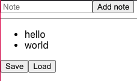

>**MaksimIvanov-MobXCollection-20200708**

> *🧩  Maksim Ivanov - MobX (July 8, 2020)*

> *Playlist Link: https://www.youtube.com/playlist?list=PLIvCYh5AD3Hzgj9YE4G2QH5dnKjNOJ_HC*

---
# 3 - Fetch Data With Mobx Note Taking App Using React Mobx and Typescript (Jul 6, 2020)

> Description:  In this video we'll learn how to fetch data in MobX applications. We'll build a note taking app using React, MobX and TypeScript

Link: [Fetch Data With Mobx Note Taking App Using React Mobx and Typescript)](https://www.youtube.com/watch?v=1fgRc1lYIEU&list=PLIvCYh5AD3Hzgj9YE4G2QH5dnKjNOJ_HC&index=2&ab_channel=MaksimIvanovMaksimIvanov)

Github: [satansdeer/mobx-react-ts](https://github.com/satansdeer/mobx-react-ts)

---


### Table of Contents

- [3 - Fetch Data With Mobx Note Taking App Using React Mobx and Typescript (Jul 6, 2020)](#3---fetch-data-with-mobx-note-taking-app-using-react-mobx-and-typescript-jul-6-2020)
    - [Table of Contents](#table-of-contents)
  - [3.1 - Project Setup](#31---project-setup)
    - [Create Project](#create-project)
    - [Reusing Server.js from Thunk Video](#reusing-serverjs-from-thunk-video)
  - [3.2 NotesStore.ts](#32-notesstorets)
    - [Observables](#observables)
    - [Enabling experimentalDecorators for MobX](#enabling-experimentaldecorators-for-mobx)
    - [Actions](#actions)
  - [3.3 - api.ts](#33---apits)
  - [3.4 - RootStateContext.tsx](#34---rootstatecontexttsx)
  - [3.5 - Index.tsx - adding provider to our app.](#35---indextsx---adding-provider-to-our-app)
  - [3.6 - Start doing our UI](#36---start-doing-our-ui)
  - [3.7 - NewNoteInput.tsx](#37---newnoteinputtsx)
- [Getting Started with Create React App](#getting-started-with-create-react-app)
  - [Available Scripts](#available-scripts)
    - [`yarn start`](#yarn-start)
    - [`yarn test`](#yarn-test)
    - [`yarn build`](#yarn-build)
    - [`yarn eject`](#yarn-eject)
  - [Learn More](#learn-more)

---
## 3.1 - Project Setup

### Create Project

```bash
npx create-react-app --template typescript 20200706-reactjstsmobx-notetakingapp

cd 20200706-reactjstsmobx-notetakingapp

yarn add mobx mobx-react-lite

code .
```

### Reusing Server.js from Thunk Video

[HOW TO USE REDUX THUNK - SAVE AND LOAD DATA FROM THE BACKEND](https://www.youtube.com/watch?v=lmyKHYmgUYc)

[satansdeer/redux-thunk](https://github.com/satansdeer/redux-thunk)

Server.js

```jsx
const express = require("express")
const cors = require("cors")
const bodyParser = require("body-parser")
const lowdb = require("lowdb")
const FileSync = require("lowdb/adapters/FileSync")

let db = lowdb(new FileSync('db.json'));

db.defaults({ notes: [] }).write()

const app = express()

app.use(cors())
app.use(bodyParser.json())

const port = 4000

app.get("/notes", (req, res) => {
  const data = db.get("notes").value()
  return res.json(data)
})

app.post("/notes", (req, res) => {
  const notes = req.body
  db.set("notes", notes).write()
  res.json({ success: true })
})

app.listen(port, () =>
  console.log(
    `Backend running on http://localhost:${port}!`
  )
)
```

db.json

```json
{
  "notes": [
    "iaonshtiaoeshtn",
    "ashiotenaishot",
    "ashioetnasiht",
    "12312341234"
  ]
}
```

Terminal: 

```bash
yarn add --dev express cors body-parser lowdb

yarn add --dev concurrently
```

Package.json - insert concurrently script as "dev" script

```json
"start:server":"node ./server.js",
"dev": "concurrently --kill-others \"npm run start:server\" \"npm run start\""
```

Now were all setup, let us now work on our src frontend.

## 3.2 NotesStore.ts

create new src/NotesStore.ts

### Observables

```tsx
import {observable,action} from 'mobx'

export class NotesStore {
  // START: OBSERVABLES
  @observable notes:string[] = []
  // END: OBSERVABLES

  // START: ACTIONS
  // EMD: ACTIONS
}
```

### Enabling experimentalDecorators for MobX

tsconfig.json

```json
"experimentalDecorators": true,
```

### Actions

```tsx
// START: ACTIONS
  /**
   * @name addNote()
   * @description add new note to notes array
   * @param note:string
   */
  @action
  addNote = (note: string) => {
    this.notes.push(note);
  }

  /**
* @name loadNotes()
* @description loads the notes to the view of the app
* @param 
*/
  @action
  loadNotes = () => {
    getNotes().then(notes => this.notes = notes);
  }

  /**
* @name saveNotes()
* @description save the current notes array to the server / database
* @param 
*/
  @action
  saveNotes = () => {
    postNotes(this.notes);
  }
  // EMD: ACTIONS
```

Overview of NotesStore.ts

```tsx
import { observable, action } from 'mobx'

export class NotesStore {
  // START: OBSERVABLES
  @observable notes: string[] = []
  // END: OBSERVABLES

  // START: ACTIONS
  /**
   * @name addNote()
   * @description add new note to notes array
   * @param note:string
   */
  @action
  addNote = (note: string) => {
    this.notes.push(note);
  }

  /**
* @name loadNotes()
* @description loads the notes to the view of the app
* @param 
*/
  @action
  loadNotes = () => {
    getNotes().then(notes => this.notes = notes);
  }

  /**
* @name saveNotes()
* @description save the current notes array to the server / database
* @param 
*/
  @action
  saveNotes = () => {
    postNotes(this.notes);
  }
  // EMD: ACTIONS
}
```

## 3.3 - api.ts

```tsx
/**
 * @name getNotes() 
 * @description gets notes from the server saved in our db.json
 */
export const getNotes = ():Promise<string[]>  =>{
  return fetch("http://localhost:4000/notes").then(res => res.json());
}

/**
 * @name postNotes()
 * @description post notes data to the server to be stored in db.json
 * @param notes 
 */
export const postNotes = (notes:string[])=>{
  fetch("http://localhost:4000/notes",{
    method:"POST",
    headers:{
      Accept:"application/json",
      "Content-Type":"application/json"
    },
    body:JSON.stringify(notes)
  })
}
```

then import the following functions in NotesStore.ts

```tsx
import {getNotes,postNotes} from './api'
```

## 3.4 - RootStateContext.tsx

```tsx
import React from "react";
import { NotesStore } from "./NotesStore";

type RootStateContextValue = {
  notesStore: NotesStore;
};

const RootStateContext = React.createContext<RootStateContextValue>(
  {} as RootStateContextValue
);

// Initialise Store
const notesStore = new NotesStore();

// Export Provider
export const RootStateProvider: React.FC<React.PropsWithChildren<{}>> = ({
  children,
}) => {
  return (
    <RootStateContext.Provider value={{ notesStore }}>
      {children}
    </RootStateContext.Provider>
  );
};
```

## 3.5 - Index.tsx - adding provider to our app.

index.tsx

```tsx
import React from "react";
import ReactDOM from "react-dom";
import "./index.css";
import App from "./App";
import reportWebVitals from "./reportWebVitals";

// Import root state provider
import { RootStateProvider } from "./RootStateContext";

ReactDOM.render(
  <React.StrictMode>
    <RootStateProvider>
      <App />
    </RootStateProvider>
  </React.StrictMode>,
  document.getElementById("root")
);

// If you want to start measuring performance in your app, pass a function
// to log results (for example: reportWebVitals(console.log))
// or send to an analytics endpoint. Learn more: https://bit.ly/CRA-vitals
reportWebVitals();
```

## 3.6 - Start doing our UI

clean up App.tsx

```tsx
import React from "react";
import "./App.css";
import { useObserver } from "mobx-react-lite";

function App() {
  return useObserver(() => <div>Hello World</div>);
}

export default App;
```

## 3.7 - NewNoteInput.tsx

```tsx
import React from "react";
import { NotesStore } from "./NotesStore";

type NewNoteInputProps = {
  addNote: NotesStore["addNote"];
};

// START: COMPONENT ---
export const NewNoteInput: React.FC<NewNoteInputProps> = ({ addNote }) => {
  // START: STATES
  const [note, setNote] = React.useState("");
  // END: STATES

  // START: METHODS
  const updateNote = (event: React.ChangeEvent<HTMLInputElement>) => {
    setNote(event.target.value);
  };

  const onAddNoteClick = () => {
    console.log("onAddNoteClick");
    addNote(note); // adds inputted note to the notes array
    setNote(""); //clear after adding note to notes array
  };

  // END: METHODS

  // START: TEMPLATE
  return (
    <div>
      <input
        type="text"
        onChange={updateNote}
        value={note}
        name="note"
        placeholder="Note"
      />
      <button onClick={onAddNoteClick}>Add note</button>
    </div>
  );
  // END: TEMPLATE
};
// END: COMPONENT ---
```

Back to App.tsx import NewNoteInput to App.tsx

```tsx
import React from "react";
import { observer } from "mobx-react-lite";
import "./App.css";

import { NewNoteInput } from "./NewNoteInput";
import { useRootStore } from "./RootStateContext";

function App() {
  const { notesStore } = useRootStore();

  // START: TEMPLATE
  return (
    <div>
      <NewNoteInput addNote={notesStore.addNote} />
      <hr />
      <ul>
        {notesStore.notes.map((note) => {
          return <li key={note}>{note}</li>;
        })}
      </ul>
      <button onClick={() => notesStore.saveNotes()}>Save</button>
      <button onClick={() => notesStore.loadNotes()}>Load</button>
    </div>
  );
  // END: TEMPLATE
}

export default observer(App);
```
---
# Getting Started with Create React App

This project was bootstrapped with [Create React App](https://github.com/facebook/create-react-app).

## Available Scripts

In the project directory, you can run:

### `yarn start`

Runs the app in the development mode.\
Open [http://localhost:3000](http://localhost:3000) to view it in the browser.

The page will reload if you make edits.\
You will also see any lint errors in the console.

### `yarn test`

Launches the test runner in the interactive watch mode.\
See the section about [running tests](https://facebook.github.io/create-react-app/docs/running-tests) for more information.

### `yarn build`

Builds the app for production to the `build` folder.\
It correctly bundles React in production mode and optimizes the build for the best performance.

The build is minified and the filenames include the hashes.\
Your app is ready to be deployed!

See the section about [deployment](https://facebook.github.io/create-react-app/docs/deployment) for more information.

### `yarn eject`

**Note: this is a one-way operation. Once you `eject`, you can’t go back!**

If you aren’t satisfied with the build tool and configuration choices, you can `eject` at any time. This command will remove the single build dependency from your project.

Instead, it will copy all the configuration files and the transitive dependencies (webpack, Babel, ESLint, etc) right into your project so you have full control over them. All of the commands except `eject` will still work, but they will point to the copied scripts so you can tweak them. At this point you’re on your own.

You don’t have to ever use `eject`. The curated feature set is suitable for small and middle deployments, and you shouldn’t feel obligated to use this feature. However we understand that this tool wouldn’t be useful if you couldn’t customize it when you are ready for it.

## Learn More

You can learn more in the [Create React App documentation](https://facebook.github.io/create-react-app/docs/getting-started).

To learn React, check out the [React documentation](https://reactjs.org/).
