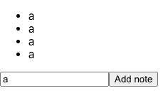

>**MaksimIvanov-MobXCollection-20200708**

> *🧩  Maksim Ivanov - MobX (July 8, 2020)*

> *Playlist Link: https://www.youtube.com/playlist?list=PLEhEHUEU3x5qz5OYDXamBmYnLvwboYTdH*

---
# 2 - How To Use React With MobX And Hooks - Note Taking App Tutorial (Jun 9, 2020)

> Description: Let's build a simple note taking app using React and Mobx with react-mobx package.

Link: [How To Use React With MobX And Hooks - Note Taking App Tutorial](https://www.youtube.com/watch?v=MKNls_FReXI&list=PLIvCYh5AD3Hzgj9YE4G2QH5dnKjNOJ_HC&index=1&ab_channel=MaksimIvanov)

Github: [satansdeer/mobx-react](https://github.com/satansdeer/mobx-react)

---


### Table of Contents


---
## 2.1 - Project Setup

```bash
npx create-react-app 20200709-reactwithmobxandhooks-notetakingapp

cd 20200709-reactwithmobxandhooks-notetakingapp

yarn add mobx mobx-react

code .
```

## 2.2 notesStore.js

create new src/notesStore.js

```jsx
import { nanoid } from 'nanoid'

export function createNotesStore() {
  return {
    notes: [],
    addNote(text) {
      this.notes.push({
        text, id: nanoid()
      })
    },
    removeNote(id) {
      this.notes = this.notes.filter(note => note.id !== id)
    }
  }
}
```

## 2.3 NotesContext.js

create new src/NotesContext.js

```jsx
// START: IMPORTS
import React from 'react'
import { createNotesStore } from './notesStore'
import { useLocalStore } from 'mobx-react'
// END: IMPORTS

const NotesContext = React.createContext(null)

export const NotesProvider = ({ children }) => {
  const notesStore = useLocalStore(createNotesStore)

  // START: TEMPLATE
  return <NotesContext.Provider value={notesStore}>
    {children}
  </NotesContext.Provider>
  // END: TEMPLATE
}

export const useNotesStore = () => React.useContext(NotesContext)
```

## 2.4 Import NotesProvider in index.js

index.js

```jsx
import React from 'react';
import ReactDOM from 'react-dom';
import './index.css';
import App from './App';
import reportWebVitals from './reportWebVitals';

import { NotesProvider } from './NotesContext'

ReactDOM.render(
  <React.StrictMode>
    <NotesProvider>
      <App />
    </NotesProvider>
  </React.StrictMode>,
  document.getElementById('root')
);

// If you want to start measuring performance in your app, pass a function
// to log results (for example: reportWebVitals(console.log))
// or send to an analytics endpoint. Learn more: https://bit.ly/CRA-vitals
reportWebVitals();
```

## 2.5 - Clean Up

- Remove App.test.js
- remove everything in App.js

```jsx
import React from 'react'

function App() {
  return (
    <>
      <ul>
        <li>Some Notes</li>
      </ul>
      <input type="text" />
      <button>Add note</button>
    </>
  )
}

export default App
```

## 2.6 - NewNoteForm.js

delete the input and button in App.js and move them to here:

create new src/NewNoteForm.js

```jsx
import React from 'react'
import { useNotesStore } from './NotesContext'

export const NewNoteForm = () => {
  // START: STATES
  const [noteText, setNoteText] = React.useState("");
  const notesStore = useNotesStore();
  // END: STATES

  // START: TEMPLATE
  return (
    <div>
      <input type="text" value={noteText} onChange={(e) => setNoteText(e.target.value)} />
      <button onClick={() => notesStore.addNote(noteText)}>Add note</button>
    </div>
  )
  // END: TEMPLATE
}
```

## 2.7 Connecting it now altogether

App.js - import NewNoteForm.js, then the store

```jsx
import React from "react";
import "./App.css";
import { NewNoteForm } from "./NewNoteForm";
import { useNotesStore } from "./NotesContext";
import { useObserver } from "mobx-react";

function App() {
  const notesStore = useNotesStore();

  return useObserver(() => (
    <>
      <ul>
        {notesStore.notes.map((note) => (
          <li onDoubleClick={
            () => notesStore.removeNote(note.id)
          } key={note.id}>{note.text}</li>
        ))}
      </ul>
      <NewNoteForm />
    </>
  ));
}

export default App;
```

---

# Getting Started with Create React App

This project was bootstrapped with [Create React App](https://github.com/facebook/create-react-app).

## Available Scripts

In the project directory, you can run:

### `yarn start`

Runs the app in the development mode.\
Open [http://localhost:3000](http://localhost:3000) to view it in the browser.

The page will reload if you make edits.\
You will also see any lint errors in the console.

### `yarn test`

Launches the test runner in the interactive watch mode.\
See the section about [running tests](https://facebook.github.io/create-react-app/docs/running-tests) for more information.

### `yarn build`

Builds the app for production to the `build` folder.\
It correctly bundles React in production mode and optimizes the build for the best performance.

The build is minified and the filenames include the hashes.\
Your app is ready to be deployed!

See the section about [deployment](https://facebook.github.io/create-react-app/docs/deployment) for more information.

### `yarn eject`

**Note: this is a one-way operation. Once you `eject`, you can’t go back!**

If you aren’t satisfied with the build tool and configuration choices, you can `eject` at any time. This command will remove the single build dependency from your project.

Instead, it will copy all the configuration files and the transitive dependencies (webpack, Babel, ESLint, etc) right into your project so you have full control over them. All of the commands except `eject` will still work, but they will point to the copied scripts so you can tweak them. At this point you’re on your own.

You don’t have to ever use `eject`. The curated feature set is suitable for small and middle deployments, and you shouldn’t feel obligated to use this feature. However we understand that this tool wouldn’t be useful if you couldn’t customize it when you are ready for it.

## Learn More

You can learn more in the [Create React App documentation](https://facebook.github.io/create-react-app/docs/getting-started).

To learn React, check out the [React documentation](https://reactjs.org/).

### Code Splitting

This section has moved here: [https://facebook.github.io/create-react-app/docs/code-splitting](https://facebook.github.io/create-react-app/docs/code-splitting)

### Analyzing the Bundle Size

This section has moved here: [https://facebook.github.io/create-react-app/docs/analyzing-the-bundle-size](https://facebook.github.io/create-react-app/docs/analyzing-the-bundle-size)

### Making a Progressive Web App

This section has moved here: [https://facebook.github.io/create-react-app/docs/making-a-progressive-web-app](https://facebook.github.io/create-react-app/docs/making-a-progressive-web-app)

### Advanced Configuration

This section has moved here: [https://facebook.github.io/create-react-app/docs/advanced-configuration](https://facebook.github.io/create-react-app/docs/advanced-configuration)

### Deployment

This section has moved here: [https://facebook.github.io/create-react-app/docs/deployment](https://facebook.github.io/create-react-app/docs/deployment)

### `yarn build` fails to minify

This section has moved here: [https://facebook.github.io/create-react-app/docs/troubleshooting#npm-run-build-fails-to-minify](https://facebook.github.io/create-react-app/docs/troubleshooting#npm-run-build-fails-to-minify)
