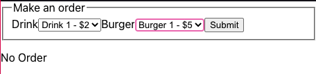

>**MaksimIvanov-MobXCollection-20200708**

> *🧩  Maksim Ivanov - MobX (July 8, 2020)*

> *Playlist Link: https://www.youtube.com/playlist?list=PLIvCYh5AD3Hzgj9YE4G2QH5dnKjNOJ_HC*

---
# 4 - Making Food Ordering App - MobX vs Redux Comparison (Jul 9, 2020)

> Description: We'll make a fast-food ordering form using React and then rewrite it using Mobx and Redux. Let'

Link: [Making Food Ordering App - MobX vs Redux Comparison](https://www.youtube.com/watch?v=uFWrquw5aHA&list=PLIvCYh5AD3Hzgj9YE4G2QH5dnKjNOJ_HC&index=4&ab_channel=MaksimIvanovMaksimIvanov)

MobX Version of Project:

[satansdeer/react-redux-mobx](https://github.com/satansdeer/react-redux-mobx/tree/master)

Redux Version of Project:

[satansdeer/react-redux-mobx](https://github.com/satansdeer/react-redux-mobx)


---


### Table of Contents

- [4 - Making Food Ordering App - MobX vs Redux Comparison (Jul 9, 2020)](#4---making-food-ordering-app---mobx-vs-redux-comparison-jul-9-2020)
    - [Table of Contents](#table-of-contents)
  - [4.1 - Project Setup (MobX Version)](#41---project-setup-mobx-version)
    - [Create Project: 20200709-reactjstsmobxvsredux-foodorderingappwithmobx](#create-project-20200709-reactjstsmobxvsredux-foodorderingappwithmobx)
  - [4.2 - types.d.ts](#42---typesdts)
  - [4.3 - OrderForm.tsx](#43---orderformtsx)
    - [react-hook-form](#react-hook-form)
  - [4.4 - OrdersList.tsx](#44---orderslisttsx)
  - [4.5 - MobX](#45---mobx)
    - [4.5.1 - ProductsStore.ts](#451---productsstorets)
    - [4.5.2 - api.ts](#452---apits)
    - [4.5.3 - StoresProvider.tsx](#453---storesprovidertsx)
    - [4.5.4 - index.tsx](#454---indextsx)
  - [4.6 - Using Store in OrderForm.tsx](#46---using-store-in-orderformtsx)
  - [4.6 New Store: OrdersStore.ts](#46-new-store-ordersstorets)
- [Getting Started with Create React App](#getting-started-with-create-react-app)
  - [Available Scripts](#available-scripts)
    - [`yarn start`](#yarn-start)
    - [`yarn test`](#yarn-test)
    - [`yarn build`](#yarn-build)
    - [`yarn eject`](#yarn-eject)
  - [Learn More](#learn-more)

---

## 4.1 - Project Setup (MobX Version)

### Create Project: 20200709-reactjstsmobxvsredux-foodorderingappwithmobx

```bash
npx create-react-app --template typescript 3-20200709-reactjstsmobxvsredux-foodorderingappwithmobx

cd 20200709-reactjstsmobxvsredux-foodorderingappwithmobx

code .
```

## 4.2 - types.d.ts

create new src/types.d.ts

```tsx
export type Product = {
  name:string,
  displayName:string,
  price:number
}
```

## 4.3 - OrderForm.tsx

create new src/OrderForm.tsx

```tsx
import React from "react";
import { Product } from "./types";

export const OrderForm = () => {
  // START: STATES
  const drinks: Product[] = [];
  const burgers: Product[] = [];
  // END: STATES

  // START: METHODS
  // END: METHODS

  // START: TEMPLATE
  return (
    <form>
      <fieldset>
        <legend>Make an Order</legend>

        {/* START: DRINK */}
        <label htmlFor="drink">Drink</label>
        <select name="drink" id="drink">
          {drinks.map((drink) => {
            return (
              <option value="drink.name" key={drink.name}>
                {drink.displayName} - ${drink.price}
              </option>
            );
          })}
        </select>
        {/* END: DRINK */}

        {/* START: BURGERS */}
        <label htmlFor="burger">Burgers</label>
        <select name="burger" id="burger">
          {burgers.map((burger) => {
            return (
              <option value="burger.name" key={burger.name}>
                {burger.displayName} - ${burger.price}
              </option>
            );
          })}
        </select>
        {/* END: BURGERS */}

        <button>Submit</button>
      </fieldset>
    </form>
  );
  // END: TEMPLATE
};
```

### react-hook-form

Terminal:

```bash
yarn add react-hook-form
```

OrderForm.tsx

- imported useForm from react-hook-form dependency
- initiated the useForm object to use its register and handleSubmit methods
- at both select tags, we added ref={register}
- afterwards, added sample initial data in our states

```tsx
// START: IMPORTS ---
import React from "react";
import { useForm } from "react-hook-form";

import { Product } from "./types";
// END: IMPORTS ---

// START: COMPONENT ---
export const OrderForm = () => {
  // START: STATES
  const drinks: Product[] = [{ name: "cola", displayName: "Cola", price: 2 }];

  const burgers: Product[] = [
    { name: "beef", displayName: "Beef Burger", price: 5 },
  ];

  const { register, handleSubmit } = useForm();
  // END: STATES

  // START: METHODS
  const onSubmit = handleSubmit((data) => {
    console.log(data);
  });
  // END: METHODS

  // START: TEMPLATE
  return (
    <form onSubmit={onSubmit}>
      <fieldset>
        <legend>Make an Order</legend>

        {/* START: DRINK */}
        <label htmlFor="drink">Drink</label>
        <select ref={register} name="drink" id="drink">
          {drinks.map((drink) => {
            return (
              <option value="drink.name" key={drink.name}>
                {drink.displayName} - ${drink.price}
              </option>
            );
          })}
        </select>
        {/* END: DRINK */}

        {/* START: BURGERS */}
        <label htmlFor="burger">Burgers</label>
        <select ref={register} name="burger" id="burger">
          {burgers.map((burger) => {
            return (
              <option value="burger.name" key={burger.name}>
                {burger.displayName} - ${burger.price}
              </option>
            );
          })}
        </select>
        {/* END: BURGERS */}

        <button>Submit</button>
      </fieldset>
    </form>
  );
  // END: TEMPLATE
};
// END: COMPONENT ---
```

App.tsx - erase everything then import OrderForm.tsx

```tsx
import React from "react";
import { OrderForm } from "./OrderForm";

function App() {
  return (
    <>
      <OrderForm />
    </>
  );
}

export default App;
```

## 4.4 - OrdersList.tsx

```tsx
// START: IMPORTS ---
import React from "react";
// END: IMPORTS ---

// START: COMPONENT ---
export const OrdersList = () => {
  // START: STATES
  const orders = [];
  // START: STATES

  // START: METHODS
  if (!orders.length) {
    return <p>No Order</p>;
  }
  // START: METHODS

  // START: TEMPLATE
  return (
    <table>
      <thead>
        <tr>
          <th>Drink</th>
          <th>Burger</th>
          <th>Total Price</th>
        </tr>
      </thead>
    </table>
  );
  // END: TEMPLATE
};
// END: COMPONENT ---
```

## 4.5 - MobX

Terminal

```bash
yarn add mobx mobx-react-lite
```

### 4.5.1 - ProductsStore.ts

create new src/ProductsStore.ts

```tsx
// START: IMPORTS ---
import { observable, action, runInAction } from 'mobx';
import {Product } from './types'
// END: IMPORTS ---

// START: STORE ---
export class ProductsStore{
  // START: OBSERVABLES
  @observable drinks:Product[] = []
  @observable burgers:Product[] = []

  @observable isLoading:boolean = true;
  // START: OBSERVABLES

  // START: ACTIONS
  @action 
  fetchProducts = async() =>{
    const drinks = await getDrinks();
    const burgers = await getBurgers();

    runInAction(() => {
      this.drinks = drinks
      this.burgers = burgers
      this.isLoading = false
    })
  }  
  // END: ACTIONS
}
// END: STORE ---
```

dont forget at your tsconfig.json - to remove the experimentalDecoractions warning

tsconfig.json

```tsx
"experimentalDecorators": true,
```

### 4.5.2 - api.ts

create new src/api.ts

```tsx
import { Product } from './types';

export const getDrinks = async (): Promise<Product[]> => (
  [
    { name: 'drink1', displayName: 'Drink 1', price: 2 },
    { name: 'drink2', displayName: 'Drink 2', price: 3 },
    { name: 'drink3', displayName: 'Drink 3', price: 4 },
  ]
)

export const getBurgers = async (): Promise<Product[]> => (
  [
    { name: 'burger1', displayName: 'Burger 1', price: 5 },
    { name: 'burger2', displayName: 'Burger 2', price: 4 },
    { name: 'burger3', displayName: 'Burger 3', price: 3 },
  ]
)
```

then back to ProductsStore.ts - import those functions 

```tsx
import { getBurgers, getDrinks } from './api';
```

### 4.5.3 - StoresProvider.tsx

```tsx
import React, { PropsWithChildren } from "react";
import { ProductsStore } from "./ProductsStore";

type StoresContextValue = {
  productsStore: ProductsStore;
};

const StoresContext = React.createContext<StoresContextValue>(
  {} as StoresContextValue
);

export const StoresProvider: React.FC<PropsWithChildren<{}>> = ({
  children,
}) => {
  const productsStore = new ProductsStore();

  return (
    <StoresContext.Provider value={{ productsStore }}>
      {children}
    </StoresContext.Provider>
  );
};
export const useStores = () => React.useContext(StoresContext);
```

### 4.5.4 - index.tsx

```tsx
import React from "react";
import ReactDOM from "react-dom";
import "./index.css";
import App from "./App";
import reportWebVitals from "./reportWebVitals";

import { StoresProvider } from "./StoresProvider";

ReactDOM.render(
  <React.StrictMode>
    <StoresProvider>
      <App />
    </StoresProvider>
  </React.StrictMode>,
  document.getElementById("root")
);

// If you want to start measuring performance in your app, pass a function
// to log results (for example: reportWebVitals(console.log))
// or send to an analytics endpoint. Learn more: https://bit.ly/CRA-vitals
reportWebVitals();
```

## 4.6 - Using Store in OrderForm.tsx

```tsx
import React, { useEffect } from "react";
import { Product } from "./types";
import { useForm } from "react-hook-form";
import { useStores } from "./StoresProvider";
import { useObserver } from "mobx-react-lite";

export const OrderForm = () => {
  const { productsStore } = useStores();

  const { register, handleSubmit } = useForm();

  const { fetchProducts } = productsStore;

  useEffect(() => {
    fetchProducts();
  }, []);

  const onSubmit = handleSubmit((data) => {});

  return useObserver(() => {
    const { isLoading, drinks, burgers } = productsStore;

    if (isLoading) {
      return <>Loading...</>;
    }

    return (
      <form onSubmit={onSubmit}>
        <fieldset>
          <legend>Make an order</legend>
          <label htmlFor="drink">Drink</label>
          <select {...register("drinks")} id="drink" name="drink">
            {drinks.map((drink) => (
              <option key={drink.name} value={drink.name}>
                {drink.displayName} - ${drink.price}
              </option>
            ))}
          </select>
          <label htmlFor="burger">Burger</label>
          <select {...register("burgers")} id="burger" name="burger">
            {burgers.map((burger) => (
              <option key={burger.name} value={burger.name}>
                {burger.displayName} - ${burger.price}
              </option>
            ))}
          </select>
          <button>Submit</button>
        </fieldset>
      </form>
    );
  });
};
```

## 4.6 New Store: OrdersStore.ts

create new src/OrdersStores.ts

```tsx
import {observable,action}from 'mobx'
import { ProductsStore } from './ProductsStore'
import {Product} from './types'

type Order={
  drink:Product
  burger:Product
  totalPrice:number
}

export class OrdersStore{
  @observable orders: Order[] = []

  constructor(private productsStore:ProductsStore){}

  @action
  addOrder = (drinkName:string,burgerName:string) =>{
    const drink = this.productsStore.drinks.find(d => d.name === drinkName);
    const burger = this.productsStore.burgers.find(b=> b.name === burgerName);

    if(!drink || !burger){
      return;
    }

    const totalPrice = drink.price + burger.price;

    this.orders.push({
      drink,
      burger,
      totalPrice
    })

  }
}
```

then import it to our StoresProvider.tsx

```tsx
import React, { PropsWithChildren } from "react";
import { ProductsStore } from "./ProductsStore";
import { OrdersStore } from "./OrdersStore";

type StoresContextValue = {
  productsStore: ProductsStore;
  ordersStore: OrdersStore; //here
};

const StoresContext = React.createContext<StoresContextValue>(
  {} as StoresContextValue
);

export const StoresProvider: React.FC<PropsWithChildren<{}>> = ({
  children,
}) => {
  const productsStore = new ProductsStore();
  const ordersStore = new OrdersStore(productsStore); //here

  return (
    <StoresContext.Provider value={{ productsStore, ordersStore }}> //here
      {children}
    </StoresContext.Provider>
  );
};
export const useStores = () => React.useContext(StoresContext);
```

and to our OrdersList.tsx

```tsx
// START: IMPORTS ---
import React from "react";
import { useObserver } from "mobx-react-lite";
import { useStores } from "./StoresProvider";

// END: IMPORTS ---

// START: COMPONENT ---
export const OrdersList = () => {
  // START: STATES
  const { ordersStore } = useStores();
  // START: STATES

  // START: METHODS
  // START: METHODS

  // START: TEMPLATE
  return useObserver(() => {
    const { orders } = ordersStore;
    if (!orders.length) {
      return <p>No Order</p>;
    }

    return (
      <table>
        <thead>
          <tr>
            <th>Drink</th>
            <th>Burger</th>
            <th>Total Price</th>
          </tr>
        </thead>

        <tbody>
          {orders.map((order, index) => {
            return (
              <tr>
                <td>{order.drink.displayName}</td>
                <td>{order.burger.displayName}</td>
                <td>{order.totalPrice}</td>
              </tr>
            );
          })}
        </tbody>
      </table>
    );
  });
  // END: TEMPLATE
};
// END: COMPONENT ---
```

now lets import it to our App.tsx

```tsx
import React from "react";
import { OrderForm } from "./OrderForm";
import { OrdersList } from "./OrdersList";

function App() {
  return (
    <>
      <OrderForm />
      <OrdersList />
    </>
  );
}

export default App;
```

we also need to add to our OrderForm.tsx

```tsx
import React, { useEffect } from "react";
import { useForm } from "react-hook-form";
import { useStores } from "./StoresProvider";
import { useObserver } from "mobx-react-lite";

export const OrderForm = () => {
  const { productsStore, ordersStore } = useStores();

  const { register, handleSubmit } = useForm();

  const { fetchProducts } = productsStore;

  useEffect(() => {
    fetchProducts();
  }, []);

  const onSubmit = handleSubmit((data) => {
    console.log(data);
    ordersStore.addOrder(data.drinks, data.burgers);
  });

  return useObserver(() => {
    const { isLoading, drinks, burgers } = productsStore;

    if (isLoading) {
      return <>Loading...</>;
    }

    return (
      <form onSubmit={onSubmit}>
        <fieldset>
          <legend>Make an order</legend>
          <label htmlFor="drink">Drink</label>
          <select {...register("drink")} id="drink" name="drink">
            {drinks.map((drink) => (
              <option key={drink.name} value={drink.name}>
                {drink.displayName} - ${drink.price}
              </option>
            ))}
          </select>
          <label htmlFor="burger">Burger</label>
          <select {...register("burger")} id="burger" name="burger">
            {burgers.map((burger) => (
              <option key={burger.name} value={burger.name}>
                {burger.displayName} - ${burger.price}
              </option>
            ))}
          </select>
          <button type="submit">Submit</button>
        </fieldset>
      </form>
    );
  });
};
```

stop at 1150, we dont need to learn redux so we know already :))

---

# Getting Started with Create React App

This project was bootstrapped with [Create React App](https://github.com/facebook/create-react-app).

## Available Scripts

In the project directory, you can run:

### `yarn start`

Runs the app in the development mode.\
Open [http://localhost:3000](http://localhost:3000) to view it in the browser.

The page will reload if you make edits.\
You will also see any lint errors in the console.

### `yarn test`

Launches the test runner in the interactive watch mode.\
See the section about [running tests](https://facebook.github.io/create-react-app/docs/running-tests) for more information.

### `yarn build`

Builds the app for production to the `build` folder.\
It correctly bundles React in production mode and optimizes the build for the best performance.

The build is minified and the filenames include the hashes.\
Your app is ready to be deployed!

See the section about [deployment](https://facebook.github.io/create-react-app/docs/deployment) for more information.

### `yarn eject`

**Note: this is a one-way operation. Once you `eject`, you can’t go back!**

If you aren’t satisfied with the build tool and configuration choices, you can `eject` at any time. This command will remove the single build dependency from your project.

Instead, it will copy all the configuration files and the transitive dependencies (webpack, Babel, ESLint, etc) right into your project so you have full control over them. All of the commands except `eject` will still work, but they will point to the copied scripts so you can tweak them. At this point you’re on your own.

You don’t have to ever use `eject`. The curated feature set is suitable for small and middle deployments, and you shouldn’t feel obligated to use this feature. However we understand that this tool wouldn’t be useful if you couldn’t customize it when you are ready for it.

## Learn More

You can learn more in the [Create React App documentation](https://facebook.github.io/create-react-app/docs/getting-started).

To learn React, check out the [React documentation](https://reactjs.org/).
